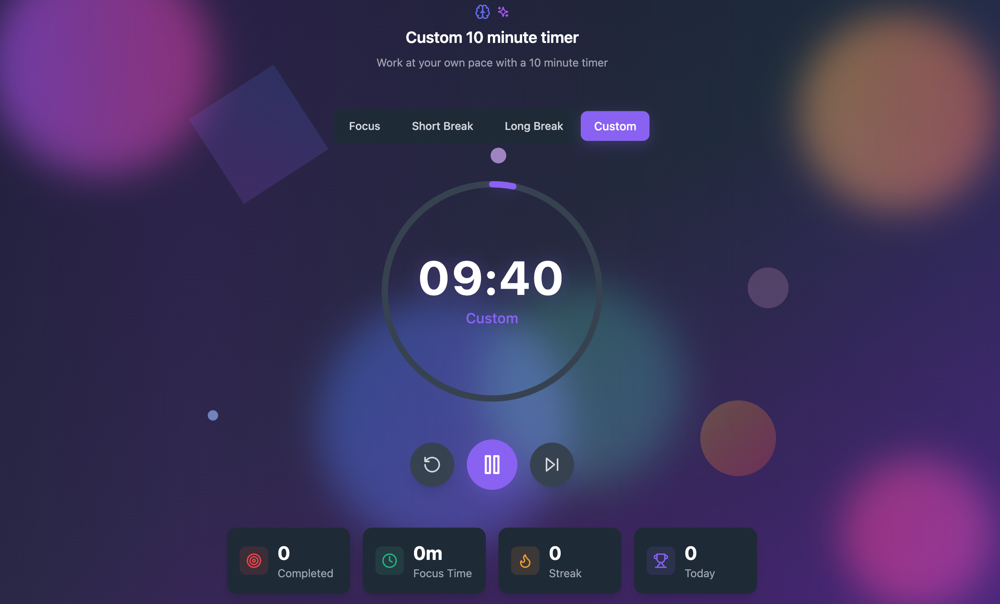

# FocuZzz - Study Timer & Productivity App

A beautiful, modern Pomodoro timer built with React, TypeScript, and Tailwind CSS. FocuZzz helps you stay focused and productive with customizable timer modes, session tracking, and a delightful user experience.
### [Try it here](https://focuzzz.netlify.app/)




## ✨ Features

### 🎯 Timer Modes
- **Focus Mode (25 min)**: Classic Pomodoro technique for deep work
- **Short Break (5 min)**: Quick breaks to refresh your mind
- **Long Break (15 min)**: Extended breaks for full recharge
- **Custom Timer**: Set your own duration for flexible work sessions

### 🎨 Beautiful UI/UX
- **Dynamic Background**: Animated floating elements for visual appeal
- **Dark/Light Theme**: Automatic theme switching with manual override
- **Progress Visualization**: Circular progress indicator with smooth animations
- **Responsive Design**: Works perfectly on desktop, tablet, and mobile

### ⚙️ Smart Features
- **Auto-start Options**: Automatically start breaks or focus sessions
- **Session Statistics**: Track completed pomodoros, focus time, and streaks
- **Sound Notifications**: Audio alerts with adjustable volume
- **Long Break Intervals**: Customize when long breaks occur (default: every 4 pomodoros)

### 📊 Session Tracking
- Completed pomodoros counter
- Total focus time tracking
- Current streak monitoring
- Daily session statistics

## 🚀 Getting Started

### Prerequisites
- Node.js (version 16 or higher)
- npm or yarn package manager

### Installation

1. **Clone the repository**
   ```bash
   git clone <repository-url>
   cd project
   ```

2. **Install dependencies**
   ```bash
   npm install
   ```

3. **Start the development server**
   ```bash
   npm run dev
   ```

4. **Open your browser**
   Navigate to `http://localhost:5173` to see the app in action!

### Build for Production

```bash
npm run build
```

The built files will be in the `dist` directory.

## 🎮 How to Use

### Basic Timer Operation
1. **Select a Mode**: Choose from Focus, Short Break, Long Break, or Custom
2. **Start Timer**: Click the play button to begin your session
3. **Pause/Resume**: Use the pause button to take control breaks
4. **Skip**: Move to the next timer mode when ready
5. **Reset**: Start over with the current mode

### Custom Timer
1. Click the "Custom" mode button
2. Enter your desired duration in minutes
3. The timer will automatically switch to your custom duration

### Settings Configuration
- **Auto-start Breaks**: Automatically begin break timers
- **Auto-start Pomodoros**: Automatically begin focus sessions
- **Long Break Interval**: Set how many pomodoros before a long break
- **Notifications**: Enable/disable browser notifications
- **Sound**: Toggle audio alerts and adjust volume
- **Theme**: Choose light, dark, or auto theme

## 🏗️ Project Structure

```
src/
├── components/          # React components
│   ├── Controls.tsx     # Timer control buttons
│   ├── CustomTimerModal.tsx  # Custom timer input modal
│   ├── DynamicBackground.tsx # Animated background
│   ├── ModeSelector.tsx      # Timer mode selection
│   ├── ProgressCircle.tsx    # Circular progress indicator
│   ├── SessionStats.tsx      # Statistics display
│   ├── Settings.tsx          # Settings panel
│   └── TimerDisplay.tsx      # Main timer display
├── hooks/
│   └── useTimer.ts      # Custom timer logic hook
├── types/
│   └── timer.ts         # TypeScript type definitions
├── utils/
│   └── timerModes.ts    # Timer mode configurations
└── App.tsx              # Main application component
```

## 🛠️ Tech Stack

- **Frontend Framework**: React 18.3.1
- **Language**: TypeScript 5.5.3
- **Build Tool**: Vite 5.4.2
- **Styling**: Tailwind CSS 3.4.17
- **Icons**: Lucide React
- **Linting**: ESLint with TypeScript support

## 🎨 Design Features

- **Gradient Backgrounds**: Beautiful color transitions
- **Smooth Animations**: CSS animations for enhanced UX
- **Floating Elements**: Dynamic background animations
- **Color-coded Modes**: Each timer mode has its own color theme
- **Responsive Layout**: Mobile-first design approach

## 📱 Browser Support

- Chrome (recommended)
- Firefox
- Safari
- Edge

## 🤝 Contributing

1. Fork the repository
2. Create a feature branch (`git checkout -b feature/amazing-feature`)
3. Commit your changes (`git commit -m 'Add amazing feature'`)
4. Push to the branch (`git push origin feature/amazing-feature`)
5. Open a Pull Request

## 📄 License

This project is licensed under the MIT License - see the [LICENSE](LICENSE) file for details.

## 🙏 Acknowledgments

- Built with focus and dedication
- Inspired by the Pomodoro Technique
- Designed for productivity and mindfulness

---

**Stay productive and focused with FocuZzz!** 🚀 
